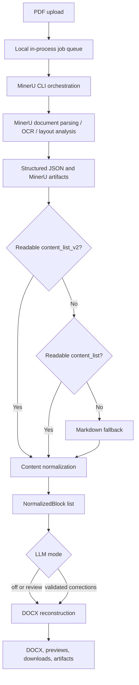
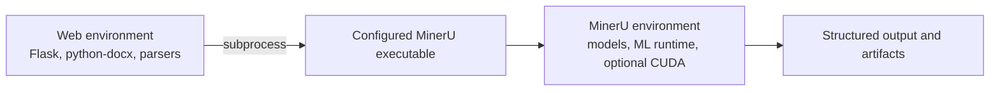
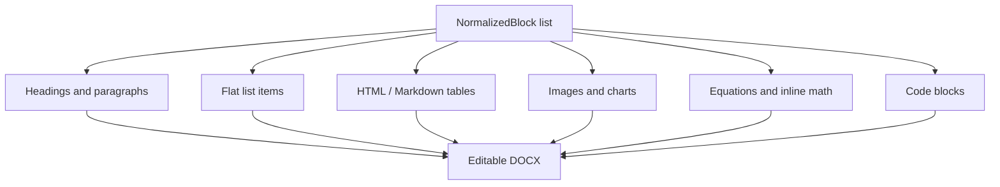

<div align="center">
  
  <p>
    
    
    
    
  </p>
  <p><a href="README.md">Tiếng Việt</a> · <strong>English</strong></p>
</div>

# PDF to Word Studio

PDF to Word Studio is a Document AI and document reconstruction system. It uses MinerU to parse PDF layout and content, normalizes MinerU-specific output into a common block representation, and rebuilds those blocks as an editable DOCX document.

This is more than text extraction:

```text
Text extraction       PDF -> plain text
OCR                   scanned page -> recognized text
Document parsing      PDF -> structured layout and content elements
Document reconstruction
                      structured elements -> editable Word structure
```

The project covers the last two stages and delegates OCR/layout understanding to the selected MinerU backend. It attempts to preserve useful document structure, not pixel-perfect PDF geometry.

## Technical Highlights

- **Structured JSON first:** `*_content_list_v2.json` is preferred over legacy `*_content_list.json`; Markdown is the final fallback.
- **Normalized intermediate representation:** MinerU output is converted into `NormalizedBlock` objects before DOCX rendering.
- **Custom DOCX reconstruction:** headings, paragraphs, flat lists, tables, figures, charts, equations, code blocks, captions, and footnotes have dedicated rendering paths.
- **Equation conversion:** LaTeX is normalized and converted through MathML to Word OMML when possible, with text fallbacks when conversion fails.
- **Backend orchestration:** local, accelerated, and HTTP-client MinerU backends share one command-building path.
- **CUDA-aware automatic selection:** `auto` selects a remote client, local hybrid backend, or pipeline according to configuration and detected CUDA availability.
- **Asynchronous conversion:** a single in-process worker handles queued jobs while the web UI polls progress and incremental MinerU logs.
- **Optional guarded LLM layer:** review is read-only; correction applies only validated, local text patches.

## End-to-End Architecture



### Responsibility boundary

| Component | Responsibility |
| --- | --- |
| MinerU | PDF parsing, OCR when requested, layout/content analysis, table/formula detection, image extraction, and raw structured output. |
| `PDFConversionService` | MinerU process orchestration, backend selection, output discovery, normalization, optional LLM review/correction, DOCX rendering, and artifact collection. |
| Flask application | Upload validation, internal API, in-memory job state, polling payloads, preview endpoints, and downloads. |
| Browser UI | Conversion options, local PDF preview, progress/log polling, simplified result previews, downloads, and local LLM provider overrides. |

## Input and Output Contract

### Input

`POST /api/convert` accepts `multipart/form-data` with a `pdf` upload and these conversion controls:

| Input | Accepted values / behavior | Default |
| --- | --- | --- |
| PDF | Filename must end in `.pdf`; non-empty; bounded by configured upload limit | Required |
| Backend | `auto`, `pipeline`, `hybrid-auto-engine`, `hybrid-engine`, `vlm-auto-engine`, `vlm-engine`, `hybrid-http-client`, `vlm-http-client` | `auto` |
| Parse method | `auto`, `txt`, `ocr` | `auto` |
| OCR language | MinerU language code exposed by the UI, including `ch`, `en`, and `latin` | `ch` |
| Formula recognition | Passed to MinerU CLI and generated MinerU config | Enabled |
| Table recognition | Passed to MinerU CLI and generated MinerU config | Enabled |
| Page range | UI uses 1-based start/end fields; end may be omitted | Start at page 1 |
| HTTP server URL | Passed as MinerU `-u`; intended for HTTP-client backends | Empty |
| LaTeX delimiters | `b` for `\(...\)` / `\[...\]`, `a` for dollar delimiters, or `all` | `b` |
| Exam formatting | Heuristic multiple-choice formatting during DOCX generation | Disabled |
| LLM mode | `off`, `review`, `correct` | `off` |

The upload limit defaults to **128 MB** and is clamped to `1–2048 MB` by `PDF_WORD_MAX_UPLOAD_MB`.

### Output

Every successful job produces a DOCX. Other files depend on MinerU output and enabled options:

- MinerU Markdown;
- `*_content_list_v2.json` or `*_content_list.json`;
- layout/span PDFs and intermediate MinerU JSON when generated;
- extracted images inside the MinerU job tree;
- MinerU stdout/stderr logs;
- optional LLM findings, patch records, request summary, fallback/error records, and Markdown report;
- an on-demand ZIP containing job files except DOCX and the ZIP itself.

The ZIP includes the uploaded PDF and MinerU image/output files still present in the job directory. It is not only a filtered list of displayed artifacts.

## MinerU Integration

MinerU is an external Document AI engine, not a dependency imported into the Flask process. The application invokes its CLI as a subprocess and streams stdout/stderr into job progress.



Keeping web and MinerU environments separate avoids coupling the lightweight web/DOCX stack to MinerU's Python, model, and CUDA dependencies.

### Command resolution

The MinerU executable is resolved in this order:

1. `MINERU_COMMAND`, parsed as a complete command;
2. `MINERU_PYTHON_EXE`, first looking for a sibling `mineru` executable, then a `mineru` executable in `PATH`, then falling back to `<python> -m mineru`;
3. `mineru` from `PATH`.

Readiness runs `<resolved command> --help` with a 20-second timeout. When `MINERU_PYTHON_EXE` is configured, Python 3.14 or newer is explicitly rejected; current project setup targets MinerU on Python **3.10–3.13**.

### MinerU command construction

The service constructs the equivalent of:

```bash
mineru \
  -p <input.pdf> \
  -o <job>/mineru \
  -b <resolved-backend> \
  -m <auto|txt|ocr> \
  -l <language> \
  -f <true|false> \
  -t <true|false>
```

Optional flags add start page (`-s`), end page (`-e`), server URL (`-u`), and `--api-url` for configured HTTP-client backends. The subprocess receives model source, VLM model, formula/table flags, and a generated `mineru_config.json` through environment variables.

## Backend Selection and Fallback

### Automatic strategy

```mermaid
flowchart TD
    AUTO[backend = auto] --> API{MINERU_API_URL configured?}
    API -->|Yes| HTTP[vlm-http-client]
    API -->|No| CUDA{torch.cuda.is_available()?}
    CUDA -->|Yes| HYBRID[hybrid-auto-engine]
    CUDA -->|No or unavailable| PIPELINE[pipeline]
```

CUDA detection runs through `MINERU_PYTHON_EXE` when configured; otherwise it attempts to import `torch` in the web environment. The application only uses this check for `auto`. Explicit backends are passed directly to MinerU, so their actual hardware/runtime requirements remain MinerU concerns.

### Runtime fallback

A job retries with `pipeline` only when all conditions hold:

- the requested backend was `auto`;
- `auto` resolved to `hybrid-auto-engine`;
- MinerU failed with a recognized CUDA shared-library or vLLM import/installation error.

Explicit accelerated backends, unrelated MinerU errors, invalid ranges, and timeouts do not trigger this fallback. MinerU execution timeout defaults to 3,600 seconds.

GPU is therefore not globally required: the application has a `pipeline` path and remote HTTP-client paths. No VRAM requirement or throughput benchmark is included in this repository.

## Structured Document Representation

The renderer does not write MinerU dictionaries directly into Word. `_load_normalized_blocks()` uses this source priority:

```text
*_content_list_v2.json
        -> *_content_list.json
        -> newest Markdown file
```

Structured JSON is preferred because it preserves element types and metadata needed to distinguish headings, paragraphs, lists, tables, visuals, equations, and code. Markdown remains useful but loses part of that structure.

`NormalizedBlock` decouples MinerU formats from DOCX rendering. Depending on block type, it carries text, heading level, list items, table HTML, image path, caption, footnote, language, page index, bounding box, and rich inline content.

For v2 output, blocks are sorted by bounding-box top/left coordinates. Headers, footers, page numbers, asides, page footnotes, and seals are skipped. `page_idx` and `bbox` support normalization/review context; the current DOCX renderer does not reproduce absolute page coordinates.

Markdown fallback recognizes headings, paragraphs, flat lists, pipe/HTML tables, image references, fenced code blocks, and explicit display equations. It is a recovery path, not an equivalent replacement for structured JSON.

## DOCX Reconstruction

`python-docx` creates a new Word document from normalized blocks. Normal output uses Arial 11 pt; exam mode applies its own page and typography rules.



### Text, headings, lists, and code

- MinerU title levels become Word headings, capped at heading level 4.
- Paragraph rich content keeps text/equation segments; fallback text also parses simple Markdown bold, italic, and inline-code markers.
- List blocks become flat Word bullet paragraphs unless an explicit letter/number marker is already present in the item text.
- Code blocks use Consolas 9 pt; captions and footnotes are rendered as italic paragraphs.
- Nested-list hierarchy, absolute alignment, page breaks, and source PDF section geometry are not reconstructed.

### Tables

```text
MinerU table HTML
    -> BeautifulSoup cell parsing
    -> rectangular text matrix
    -> Word Table Grid
```

Cell content supports the same inline text/math renderer. `colspan` is expanded by duplicating cell text; cells are not merged in Word. `rowspan`, nested tables, and source-specific visual styling are not reconstructed. If HTML cannot be parsed, the renderer falls back to table text, then to a table image when available.

### Images and figures

MinerU detects/extracts images and charts. The application resolves absolute or relative artifact paths, also searching nearby `images/` directories, then inserts the asset into DOCX.

Inserted visuals are centered and scaled down to page width, at most approximately 6.8 × 4.8 inches; smaller images are not enlarged. Captions are placed before the visual and footnotes after it. Missing or unreadable assets produce a text placeholder rather than aborting the whole document.

### Mathematical formulas

Inline and display delimiters are detected, and common implicit LaTeX patterns are also recognized heuristically. Formula rendering follows:

```text
LaTeX
  -> normalization
  -> latex2mathml
  -> MathML
  -> mathml2omml
  -> Word OMML equation
```

If conversion fails, the renderer falls back to a limited plain-text representation; vector notation has an additional direct OMML fallback. Equations are therefore editable when OMML conversion succeeds, but not guaranteed to be fully editable or semantically identical for every LaTeX construct.

### Exam formatting

`exam_format` is a heuristic formatter, not semantic question answering. It:

- detects A/B/C/D option markers;
- sorts complete four-option groups;
- places short options four per line, medium options two per line, and long options one per line;
- uses Times New Roman 14 pt, 1.5 line spacing, justified body text, and fixed page margins;
- emphasizes recognized question and option labels.

It does not determine correct answers or repair question semantics.

## OCR and Parsing Modes

| Mode | Application behavior |
| --- | --- |
| `auto` | MinerU decides parsing strategy. |
| `txt` | Requests MinerU text-based parsing. |
| `ocr` | Forces MinerU OCR-oriented parsing; the UI also exposes a “Force OCR” toggle that selects this mode. |

For scanned PDFs, recognition quality depends on scan quality, selected language, MinerU models, and backend. The repository does not implement its own OCR model.

## Optional LLM Review and Correction

The LLM layer is not required for PDF-to-DOCX conversion.

| Mode | Behavior |
| --- | --- |
| `off` | Skip all LLM calls. |
| `review` | Send normalized text-bearing fields in page-sized chunks and write findings/report artifacts; DOCX content is unchanged. |
| `correct` | Collect proposed patches, validate each patch locally, then render accepted changes. |

Only text-bearing normalized fields are exposed to patching: block text, list items, captions, and footnotes. Table HTML, image paths, ordering, and geometry are not patch targets.

A correction patch is accepted only when it has confidence ≥ 0.75, targets an existing field and exact `old_text`, preserves numbers and LaTeX command sequences, and stays within similarity/size limits. This reduces broad rewrites; it does not guarantee semantic correctness.

Supported OpenAI-compatible providers:

| Provider | API key | Default base URL | Default model behavior |
| --- | --- | --- | --- |
| NVIDIA | `NVIDIA_API_KEY` | `https://integrate.api.nvidia.com/v1` | `google/gemma-3-27b-it` |
| OpenRouter | `OPENROUTER_API_KEY` | `https://openrouter.ai/api/v1` | `google/gemma-4-26b-a4b-it:free` through the `openrouter/` prefix |
| 9route | `ROUTER9_API_KEY` and documented aliases | `http://localhost:20128/v1` | Must come from settings or `ROUTER9_TEXT_MODEL` / `ROUTE9_TEXT_MODEL` |

The Settings page can query a provider's `/models` endpoint. Provider/model fallbacks are configuration-dependent; `router9_only` disables fallback away from 9route.

## Job Processing, Progress, and Artifacts

`POST /api/convert` stores the upload, creates a job, submits it to `ThreadPoolExecutor(max_workers=1)`, and returns `202 Accepted` with a `job_id`.

```text
upload -> queued -> running -> completed | failed
                       |
                       +-> prepare
                       +-> mineru
                       +-> mineru_fallback (conditional)
                       +-> normalize
                       +-> llm_review (optional)
                       +-> docx
                       +-> artifacts
```

The frontend polls `/api/jobs/<job_id>` every 1.8 seconds. Poll responses include stage, monotonic progress, estimated timing, message, and up to 400 recent terminal lines. This is polling-based incremental log display, not WebSocket streaming.

Each job uses:

```text
webapp/runtime/jobs/<job_id>/
├── input/                 uploaded PDF
├── mineru/                MinerU config, logs, structured output, images, PDFs
├── docx/                  reconstructed Word document
├── llm_review/            optional LLM reports and patch records
└── artifacts_without_docx.zip   created only when requested
```

Job metadata lives only in process memory and expires after 24 hours of inactivity. Expiration or process restart removes API-visible state, not files. Runtime job files have no automatic filesystem retention cleanup in the current implementation.

### Preview behavior

- Uploaded PDF preview uses a browser object URL before submission.
- MinerU PDF artifacts can be served inline.
- DOCX preview reopens the generated file and emits bounded HTML for paragraph/table text, including readable equation text.
- DOCX preview is not a Word renderer: images, exact styles, pagination, and layout fidelity are not represented.

## Internal Web API

These routes support the bundled frontend. They are not versioned or authenticated as a public production API.

| Method | Route | Purpose |
| --- | --- | --- |
| `GET` | `/api/status` | MinerU readiness, upload limit, and recent in-memory results |
| `POST` | `/api/convert` | Validate upload/options, enqueue conversion, return `202` and `job_id` |
| `GET` | `/api/jobs/<job_id>` | Poll progress, logs, failure, or result |
| `GET` | `/api/llm/providers` | Return provider defaults without API key values |
| `POST` | `/api/llm/providers/<provider>/models` | Query an OpenAI-compatible model list |
| `GET` | `/downloads/<job_id>/<filename>` | Download a job file |
| `GET` | `/downloads/<job_id>/artifacts.zip` | Build and download the non-DOCX job ZIP |
| `GET` | `/previews/<job_id>/<filename>` | Serve a PDF artifact inline |
| `GET` | `/api/previews/<job_id>/<filename>` | Return simplified DOCX preview HTML in JSON |

## Installation

### Environment 1 — Web application

The repository does not pin the web interpreter version. Create an isolated environment and install the declared Flask, parsing, image, equation, DOCX, and test dependencies:

```bash
python -m venv .venv
source .venv/bin/activate
python -m pip install --upgrade pip
python -m pip install -r requirements.txt
```

### Environment 2 — MinerU on Linux/macOS

Use Python 3.10–3.13 for the MinerU environment. Example with Python 3.12:

```bash
python3.12 -m venv .venv-mineru
.venv-mineru/bin/python -m pip install --upgrade pip
.venv-mineru/bin/python -m pip install -U "mineru[all]" "mineru-vl-utils[transformers]"
```

Start the application from the activated web environment:

```bash
export MINERU_PYTHON_EXE="$PWD/.venv-mineru/bin/python"
python -m webapp.app
```

Open [http://127.0.0.1:8386](http://127.0.0.1:8386).

### Windows PowerShell

The included script creates `.venv-mineru`, installs MinerU with `uv`, and attempts to download all Hugging Face models. It defaults to Python 3.12 through the `py` launcher and accepts a custom Python 3.10–3.13 executable.

```powershell
py -m venv .venv
.\.venv\Scripts\Activate.ps1
python -m pip install --upgrade pip
python -m pip install -r requirements.txt
.\scripts\setup_mineru_env.ps1
$env:MINERU_PYTHON_EXE = (Resolve-Path ".\.venv-mineru\Scripts\python.exe").Path
python -m webapp.app
```

## Configuration

### Web application

| Variable | Default | Purpose |
| --- | --- | --- |
| `PDF_WORD_WEBAPP_HOST` | `0.0.0.0` | Flask bind host |
| `PDF_WORD_WEBAPP_PORT` | `8386` | Flask port; invalid values fall back to `8386` |
| `PDF_WORD_MAX_UPLOAD_MB` | `128` | Upload limit, clamped to `1–2048` MB |
| `PDF_WORD_BACKEND` | `auto` | Initial backend selection |
| `PDF_WORD_KEEP_ARTIFACTS` | `true` | Keep full job tree; `false` prunes files outside retained artifact kinds after DOCX generation |
| `PDF_WORD_WEBAPP_DEBUG` | `false` | Flask debug mode |
| `PDF_WORD_WEBAPP_RELOADER` | `false` | Flask reloader |

### MinerU

| Variable | Default | Purpose |
| --- | --- | --- |
| `MINERU_COMMAND` | Empty | Complete MinerU command override |
| `MINERU_PYTHON_EXE` | Empty | Python executable for the separate MinerU environment |
| `MINERU_MODEL_SOURCE` | `huggingface` | MinerU model source passed to subprocess |
| `MINERU_VL_MODEL_NAME` | `opendatalab/MinerU2.5-Pro-2605-1.2B` | VLM model passed to subprocess |
| `MINERU_API_URL` | Empty | Remote MinerU API URL; makes `auto` select `vlm-http-client` |
| `MINERU_TIMEOUT_SECONDS` | `3600` | Process timeout, clamped to `60–86400` seconds |
| `MINERU_TOOLS_CONFIG_JSON` | `~/mineru.json` when unset | Optional source config copied before applying LaTeX delimiter settings |

### Optional LLM

| Variable | Default | Purpose |
| --- | --- | --- |
| `PDF_WORD_LLM_PROVIDER` | `auto` | Initial provider selection |
| `PDF_WORD_LLM_MODEL` | `google/gemma-3-27b-it` | Initial LLM model |
| `NVIDIA_API_KEY` | Empty | NVIDIA credential |
| `OPENROUTER_API_KEY` | Empty | OpenRouter credential |
| `ROUTER9_API_KEY` | Empty | 9route credential; aliases also supported |
| `NVIDIA_BASE_URL` | NVIDIA integration API | NVIDIA endpoint override |
| `OPENROUTER_BASE_URL` | OpenRouter API | OpenRouter endpoint override |
| `ROUTER9_BASE_URL` | `http://localhost:20128/v1` | 9route endpoint override |
| `ROUTER9_TEXT_MODEL` | Empty | Default 9route text model |
| `ROUTER9_ONLY` | `false` | Disable cross-provider fallback for 9route |

OpenRouter also supports `OPENROUTER_HTTP_REFERER` and `OPENROUTER_APP_NAME`. 9route aliases accepted by the implementation are `ROUTE9_API_KEY`, `NINEROUTE_API_KEY`, `9ROUTE_API_KEY`, `ROUTE9_BASE_URL`, `9ROUTE_BASE_URL`, `ROUTE9_TEXT_MODEL`, and `ROUTE9_ONLY`. Fallback models can be configured with `ROUTER9_FALLBACK_MODEL` / `ROUTE9_FALLBACK_MODEL`, `OPENROUTER_FALLBACK_MODEL`, and `NVIDIA_FALLBACK_MODEL`.

## Usage

1. Open `/` and confirm that the MinerU readiness card is green.
2. Select a PDF and review backend, parse method, language, page range, table/formula, exam, and optional LLM settings.
3. Submit the form. The API returns a queued job immediately.
4. Follow progress and MinerU terminal lines in the UI.
5. Download the DOCX, inspect simplified previews, or download the job artifact ZIP.

Use `/settings` to manage browser-local LLM API key/base URL/model overrides and scan provider models.

## Project Structure

```text
pdf-to-word-mineru/
├── webapp/
│   ├── app.py                    Flask UI/API, preview, and download layer
│   ├── pdf_service.py            MinerU orchestration, normalization, jobs,
│   │                             LLM layer, and DOCX reconstruction
│   ├── templates/
│   │   ├── pdf_to_word.html      active conversion workflow
│   │   ├── settings.html         active LLM provider settings
│   │   └── base.html             shared application shell
│   ├── static/css/style.css      active web styling
│   └── runtime/jobs/             generated local job data; Git-ignored
├── scripts/setup_mineru_env.ps1  Windows MinerU environment setup
├── tests/test_pdf_service.py     service, renderer, fallback, LLM, and API tests
├── requirements.txt              web/DOCX/test dependencies
└── README.md
```

MinerU remains an external executable/environment rather than a source module in this repository.

## Testing

After installing `requirements.txt`:

```bash
pytest
```

The current single test module contains 49 test functions covering structured and Markdown normalization, DOCX text/table/image-adjacent behavior, formula-to-OMML paths and fallbacks, exam heuristics, backend command construction and CUDA/vLLM fallback, job completion, artifact ZIP scoping, LLM provider mapping/fallback/safe request handling, DOCX preview, and selected Flask API validation.

The repository currently includes no sample PDF/DOCX fixture and no reproducible quantitative benchmark for OCR accuracy, table structure, layout similarity, or document fidelity.

## Limitations

- Reconstruction is semantic/structural, not pixel-perfect; absolute positions, pagination, fonts, and complex multi-column geometry can differ from the PDF.
- OCR and element quality depend on the source scan and selected MinerU backend/model.
- Tables do not preserve true merged cells, `rowspan`, nested tables, or full visual styling.
- Equation editability depends on successful LaTeX-to-OMML conversion; unsupported expressions fall back to limited text.
- Lists are flat, and image placement is centered rather than reconstructed from PDF coordinates.
- The job queue and metadata are in process memory with one worker; restart loses API-visible state and concurrent conversions serialize.
- Optional LLM correction is constrained but cannot guarantee semantic correctness.

## Privacy and Security Notes

- Uploaded PDFs and generated files are stored under `webapp/runtime/jobs/<job_id>/`. The directory is Git-ignored but has no automatic disk cleanup.
- The artifact ZIP can include the original uploaded PDF and extracted MinerU files. Treat it as sensitive when the source document is sensitive.
- HTTP-client MinerU backends may send the PDF to the configured MinerU service.
- LLM modes send normalized extracted text fields to the selected external provider; they do not send the original PDF or image bytes through the LLM request path.
- Environment API keys remain server-side. Settings-page overrides are stored in browser `localStorage`, submitted to the backend for the request, and excluded from result summaries/review artifacts.
- Current routes have no authentication, and CORS permits requesting origins. Do not expose this development server to untrusted networks without an authenticated reverse proxy and appropriate transport security.

## Future Improvements

- Persistent job metadata and an external worker queue for restart-safe/concurrent processing.
- Explicit runtime retention and cleanup policies for uploads and artifacts.
- Better multi-column, page-break, merged-cell, and image-placement reconstruction.
- Reproducible document-fidelity fixtures and quantitative evaluation.
- Authentication and deployment hardening for non-local use.

## License

No license file is currently included. Add an explicit license before redistribution or third-party reuse.

---

<div align="center">
  
  <em>Document AI for editable, reusable content.</em>
</div>