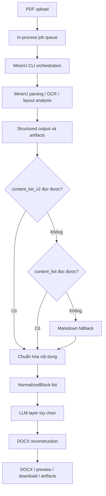
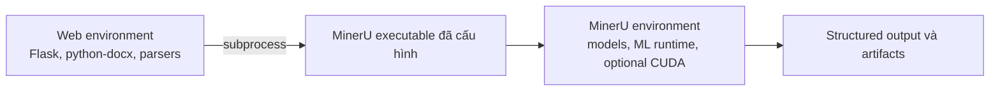
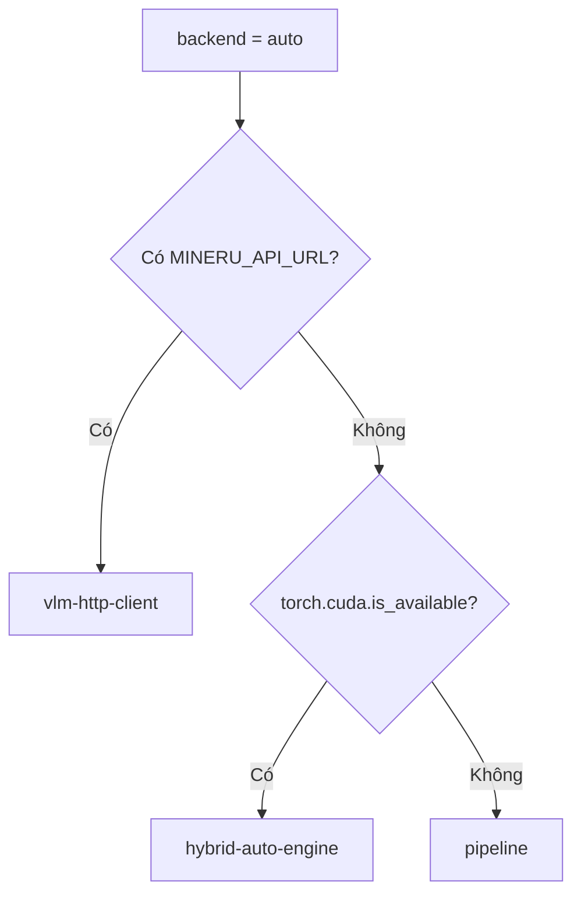
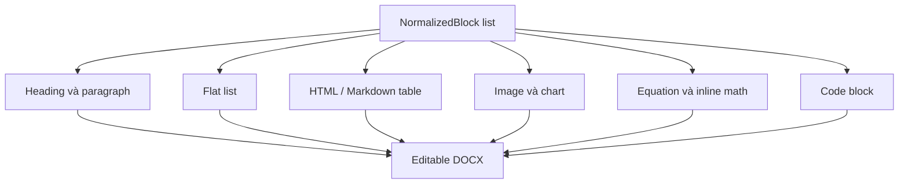

<div align="center">
  
  <p>
    
    
    
    
  </p>
  <p><strong>Tiếng Việt</strong> · <a href="README.en.md">English</a></p>
</div>

# PDF to Word Studio

PDF to Word Studio là hệ thống **Document AI và tái tạo tài liệu**. MinerU phân tích bố cục và nội dung PDF; ứng dụng chuẩn hóa output đặc thù của MinerU thành biểu diễn tài liệu trung gian, sau đó dựng lại thành DOCX có thể chỉnh sửa.

```text
PDF
-> MinerU phân tích tài liệu / OCR
-> structured JSON hoặc Markdown fallback
-> normalized document blocks
-> LLM review/correction tùy chọn
-> tái tạo DOCX
-> preview, download và artifacts
```

Đây không chỉ là trích xuất text và không cam kết tái tạo hình học PDF theo kiểu pixel-perfect.

## Bài toán được giải quyết

```text
Text extraction       PDF -> plain text
OCR                   trang scan -> text được nhận diện
Document parsing      PDF -> phần tử nội dung và bố cục có cấu trúc
Document reconstruction
                      phần tử có cấu trúc -> tài liệu Word có thể chỉnh sửa
```

Project thực hiện hai giai đoạn cuối. MinerU chịu trách nhiệm document understanding, OCR và layout analysis; ứng dụng chịu trách nhiệm orchestration, normalization, DOCX reconstruction, job processing, preview và artifact management.

## Điểm kỹ thuật nổi bật

- **Structured JSON first:** ưu tiên `*_content_list_v2.json`, sau đó `*_content_list.json`; Markdown là fallback cuối.
- **Biểu diễn trung gian:** `NormalizedBlock` tách MinerU format khỏi DOCX renderer.
- **DOCX reconstruction riêng:** có đường render cho heading, paragraph, flat list, table, image, chart, equation, code, caption và footnote.
- **Chuyển đổi công thức:** LaTeX được chuẩn hóa, chuyển qua MathML sang Word OMML khi có thể; lỗi chuyển đổi dùng text fallback.
- **Nhiều MinerU backend:** backend local, accelerated và HTTP client dùng chung một luồng command construction.
- **Tự động nhận biết CUDA:** `auto` chọn remote client, local hybrid hoặc `pipeline` theo config và CUDA availability.
- **Job bất đồng bộ:** một in-process worker xử lý hàng đợi; frontend polling progress và log MinerU tăng dần.
- **LLM tùy chọn có kiểm soát:** `review` không sửa tài liệu; `correct` chỉ áp dụng text patch vượt qua validation cục bộ.

## Kiến trúc end-to-end



### Ranh giới trách nhiệm

| Thành phần | Trách nhiệm |
| --- | --- |
| MinerU | PDF parsing, OCR khi được yêu cầu, layout/content analysis, phát hiện bảng/công thức, extract ảnh và tạo raw structured output. |
| `PDFConversionService` | Chạy MinerU subprocess, chọn backend, tìm output, normalization, LLM layer, DOCX rendering và thu thập artifact. |
| Flask application | Upload validation, internal API, job state trong memory, polling payload, preview và download. |
| Browser UI | Conversion options, PDF preview cục bộ, polling progress/log, result preview rút gọn và LLM provider settings. |

## Input và output

### Input

`POST /api/convert` nhận `multipart/form-data` với file `pdf` không rỗng, tên kết thúc bằng `.pdf`, cùng các tùy chọn:

| Tùy chọn | Giá trị / behavior | Mặc định |
| --- | --- | --- |
| Backend | `auto`, `pipeline`, `hybrid-auto-engine`, `hybrid-engine`, `vlm-auto-engine`, `vlm-engine`, `hybrid-http-client`, `vlm-http-client` | `auto` |
| Parse method | `auto`, `txt`, `ocr` | `auto` |
| OCR language | MinerU language code được UI cung cấp, gồm `ch`, `en`, `latin` và các code khác | `ch` |
| Formula recognition | Boolean truyền vào MinerU CLI và generated config | Bật |
| Table recognition | Boolean truyền vào MinerU CLI và generated config | Bật |
| Page range | UI dùng start/end page 1-based; end có thể để trống | Từ trang 1 |
| HTTP server URL | Truyền bằng MinerU `-u`, dành cho HTTP-client backend | Rỗng |
| LaTeX delimiter | `b` cho `\(...\)` / `\[...\]`, `a` cho dollar delimiter, hoặc `all` | `b` |
| Exam formatting | Heuristic format đề trắc nghiệm khi tạo DOCX | Tắt |
| LLM mode | `off`, `review`, `correct` | `off` |

Giới hạn upload mặc định là **128 MB**, được clamp trong khoảng `1–2048 MB` bằng `PDF_WORD_MAX_UPLOAD_MB`.

### Output

Mỗi job thành công luôn tạo DOCX. Các output khác phụ thuộc MinerU và config:

- MinerU Markdown;
- `*_content_list_v2.json` hoặc `*_content_list.json`;
- layout/span PDF và intermediate MinerU JSON khi có;
- ảnh được MinerU extract trong job tree;
- `mineru_stdout.log` và `mineru_stderr.log`;
- LLM findings, patch records, request summary, fallback/error records và Markdown report khi bật LLM;
- ZIP tạo theo yêu cầu, chứa các file job còn tồn tại ngoại trừ DOCX và chính file ZIP.

ZIP có thể chứa PDF upload ban đầu, ảnh và output MinerU; nó không chỉ chứa danh sách artifact hiển thị trên UI.

## Tích hợp MinerU

MinerU là external Document AI engine, không được import vào Flask process. Ứng dụng gọi MinerU CLI bằng subprocess và đưa stdout/stderr vào progress state của job.



Tách hai environment giúp web/DOCX stack không bị phụ thuộc vào ràng buộc Python, model, ML runtime và CUDA của MinerU.

### Thứ tự tìm MinerU command

1. `MINERU_COMMAND`, được parse như complete command.
2. `MINERU_PYTHON_EXE`: tìm `mineru` cạnh Python executable, sau đó tìm trong `PATH`, cuối cùng dùng `<python> -m mineru`.
3. `mineru` trong `PATH`.

Readiness chạy `<resolved command> --help` với timeout 20 giây. Khi dùng `MINERU_PYTHON_EXE`, Python 3.14 trở lên bị từ chối; setup hiện tại nhắm MinerU trên Python **3.10–3.13**.

### MinerU command construction

```bash
mineru \
  -p <input.pdf> \
  -o <job>/mineru \
  -b <resolved-backend> \
  -m <auto|txt|ocr> \
  -l <language> \
  -f <true|false> \
  -t <true|false>
```

Start page (`-s`), end page (`-e`), server URL (`-u`) và `--api-url` được thêm khi phù hợp. Subprocess nhận model source, VLM model, formula/table flags và generated `mineru_config.json` qua environment.

## Chiến lược backend

### Lựa chọn tự động



Nếu có `MINERU_PYTHON_EXE`, CUDA detection chạy trong MinerU environment; nếu không, ứng dụng thử import `torch` trong web environment. Kiểm tra này chỉ phục vụ backend `auto`. Backend được chọn rõ ràng sẽ được truyền thẳng cho MinerU.

### Runtime fallback

Job chỉ retry bằng `pipeline` khi đồng thời thỏa mãn:

- backend được yêu cầu là `auto`;
- `auto` resolve thành `hybrid-auto-engine`;
- MinerU lỗi do CUDA shared library hoặc lỗi import/cài đặt vLLM đã được nhận diện.

Backend accelerated được chọn rõ ràng, lỗi MinerU không liên quan, page range không hợp lệ và timeout không kích hoạt fallback này. MinerU timeout mặc định là 3.600 giây.

GPU không bắt buộc cho mọi cấu hình: ứng dụng có `pipeline` và remote HTTP-client path. Repository không có VRAM requirement hoặc throughput benchmark có thể tái lập.

## Biểu diễn tài liệu trung gian

Thứ tự nguồn dữ liệu:

```text
*_content_list_v2.json
-> *_content_list.json
-> file Markdown mới nhất
```

Structured JSON giữ element type và metadata tốt hơn Markdown, giúp phân biệt title, paragraph, list, table, image, chart, equation và code trước khi render.

`NormalizedBlock` có thể chứa:

- `kind`, text và heading level;
- list items;
- table HTML;
- image path;
- caption và footnote;
- language;
- page index và bounding box;
- rich inline content.

Với v2 output, block được sắp xếp theo tọa độ trên/trái của bounding box. Header, footer, page number, aside, page footnote và seal bị bỏ qua. `page_idx` và `bbox` phục vụ normalization/review context; renderer hiện tại không tái tạo absolute PDF coordinates.

Markdown fallback nhận diện heading, paragraph, flat list, pipe/HTML table, image reference, fenced code và display equation. Đây là đường phục hồi, không tương đương structured JSON.

## Tái tạo DOCX

`python-docx` tạo tài liệu Word mới từ danh sách `NormalizedBlock`. Normal style dùng Arial 11 pt; exam mode dùng cấu hình riêng.



### Text, heading, list và code

- MinerU title level trở thành Word heading, tối đa level 4.
- Rich paragraph content giữ text/equation segment; fallback text parse Markdown bold, italic và inline code đơn giản.
- List block trở thành flat Word bullet, trừ item đã có marker chữ/số rõ ràng.
- Code block dùng Consolas 9 pt.
- Caption và footnote được render thành paragraph italic.
- Nested-list hierarchy, absolute alignment, page break và source section geometry không được tái tạo.

### Bảng

```text
MinerU table HTML
-> BeautifulSoup parse cell
-> rectangular text matrix
-> Word Table Grid
```

Cell dùng chung inline text/math renderer. `colspan` được mở rộng bằng cách lặp text, không tạo merged cell thật trong Word. `rowspan`, nested table và visual styling gốc không được tái tạo. Nếu HTML không parse được, renderer fallback sang table text, sau đó table image nếu có.

### Ảnh và figure

MinerU phát hiện/extract image và chart. Ứng dụng resolve absolute/relative path, tìm thêm trong các thư mục `images/` lân cận, sau đó chèn asset vào DOCX.

Ảnh được căn giữa và chỉ scale nhỏ xuống để vừa trang, với giới hạn xấp xỉ 6,8 × 4,8 inch; ảnh nhỏ không bị phóng lớn. Caption nằm trước ảnh, footnote nằm sau. File thiếu hoặc không đọc được tạo text placeholder thay vì làm hỏng toàn bộ conversion.

### Công thức toán

Inline/display delimiter và một số implicit LaTeX pattern được nhận diện bằng heuristic.

```text
LaTeX
-> normalization
-> latex2mathml
-> MathML
-> mathml2omml
-> Word OMML equation
```

Nếu conversion thất bại, renderer dùng plain-text representation giới hạn; vector notation có direct OMML fallback riêng. Công thức có thể chỉnh sửa khi OMML conversion thành công, nhưng không được đảm bảo cho mọi LaTeX construct.

### Format đề trắc nghiệm

`exam_format` là heuristic formatter, không phải semantic question answering. Chức năng này:

- nhận diện marker A/B/C/D;
- sắp xếp nhóm đủ bốn lựa chọn;
- bố trí lựa chọn ngắn theo 4 cột, trung bình theo 2 cột, dài theo 1 cột;
- dùng Times New Roman 14 pt, line spacing 1.5 và fixed margins;
- nhấn mạnh question/option label được nhận diện.

Nó không xác định đáp án đúng hoặc sửa ngữ nghĩa câu hỏi.

## OCR và parse mode

| Mode | Behavior |
| --- | --- |
| `auto` | MinerU quyết định chiến lược parse. |
| `txt` | Yêu cầu MinerU parse theo text layer. |
| `ocr` | Yêu cầu MinerU parse theo hướng OCR; toggle “Ép OCR” trên UI chọn mode này. |

Ứng dụng không có OCR model riêng. Kết quả PDF scan phụ thuộc chất lượng scan, language, MinerU model và backend.

## LLM review và correction tùy chọn

LLM không bắt buộc trong core PDF-to-DOCX pipeline.

| Mode | Behavior |
| --- | --- |
| `off` | Không gọi LLM. |
| `review` | Gửi field có text theo chunk, ghi findings/report, không sửa block. |
| `correct` | Nhận patch đề xuất, validate cục bộ, chỉ render thay đổi được chấp nhận. |

Field có thể patch gồm block text, list item, caption và footnote. Table HTML, image path, thứ tự và geometry không phải patch target.

Patch chỉ được chấp nhận khi:

- confidence ≥ 0.75;
- `block_index`, field và `old_text` khớp dữ liệu hiện tại;
- không thay đổi chuỗi số;
- không thay đổi LaTeX command sequence;
- thay đổi nằm trong giới hạn similarity và kích thước.

Cơ chế này giảm broad rewrite nhưng không bảo đảm semantic correctness.

| Provider | API key | Base URL mặc định | Model mặc định |
| --- | --- | --- | --- |
| NVIDIA | `NVIDIA_API_KEY` | `https://integrate.api.nvidia.com/v1` | `google/gemma-3-27b-it` |
| OpenRouter | `OPENROUTER_API_KEY` | `https://openrouter.ai/api/v1` | `google/gemma-4-26b-a4b-it:free` |
| 9route | `ROUTER9_API_KEY` và alias | `http://localhost:20128/v1` | Cần config/settings |

Settings page có thể gọi endpoint `/models` của provider. `router9_only` tắt fallback sang provider khác.

## Job, progress và artifacts

`POST /api/convert` lưu upload, tạo job, submit vào `ThreadPoolExecutor(max_workers=1)` và trả `202 Accepted` với `job_id`.

```text
upload -> queued -> running -> completed | failed
                       |
                       +-> prepare
                       +-> mineru
                       +-> mineru_fallback (nếu có)
                       +-> normalize
                       +-> llm_review (tùy chọn)
                       +-> docx
                       +-> artifacts
```

Frontend poll `/api/jobs/<job_id>` mỗi 1,8 giây. Payload gồm stage, progress không lùi, timing estimate, message và tối đa 400 terminal line gần nhất. Đây là polling-based incremental log, không phải WebSocket streaming.

```text
webapp/runtime/jobs/<job_id>/
├── input/                 PDF upload
├── mineru/                config, log, structured output, image, PDF
├── docx/                  tài liệu Word kết quả
├── llm_review/            report và patch record tùy chọn
└── artifacts_without_docx.zip   chỉ tạo khi được yêu cầu
```

Job metadata chỉ tồn tại trong process memory và hết hạn sau 24 giờ không hoạt động. Restart hoặc metadata expiry làm mất API-visible state nhưng không xóa file. Implementation hiện tại không tự cleanup runtime files trên disk.

### Preview

- PDF trước upload dùng browser object URL.
- MinerU PDF artifact có thể được serve inline.
- DOCX preview mở lại file và sinh HTML giới hạn cho paragraph/table text và equation text.
- DOCX preview không phải Word renderer: không thể hiện image, pagination, exact style hoặc layout fidelity.

## Internal Web API

Các route này phục vụ frontend đi kèm; chúng không phải production public API có version/authentication.

| Method | Route | Mục đích |
| --- | --- | --- |
| `GET` | `/api/status` | MinerU readiness, upload limit và recent result trong memory |
| `POST` | `/api/convert` | Validate upload/options, enqueue job, trả `202` và `job_id` |
| `GET` | `/api/jobs/<job_id>` | Poll progress, log, lỗi hoặc result |
| `GET` | `/api/llm/providers` | Provider defaults không chứa API key value |
| `POST` | `/api/llm/providers/<provider>/models` | Query OpenAI-compatible model list |
| `GET` | `/downloads/<job_id>/<filename>` | Download job file |
| `GET` | `/downloads/<job_id>/artifacts.zip` | Tạo và download non-DOCX job ZIP |
| `GET` | `/previews/<job_id>/<filename>` | Serve PDF artifact inline |
| `GET` | `/api/previews/<job_id>/<filename>` | Trả simplified DOCX preview HTML trong JSON |

## Cài đặt

### Environment 1 — Web application

Repository không pin phiên bản Python cho web environment.

```bash
python -m venv .venv
source .venv/bin/activate
python -m pip install --upgrade pip
python -m pip install -r requirements.txt
```

### Environment 2 — MinerU trên Linux/macOS

Dùng Python 3.10–3.13. Ví dụ với Python 3.12:

```bash
python3.12 -m venv .venv-mineru
.venv-mineru/bin/python -m pip install --upgrade pip
.venv-mineru/bin/python -m pip install -U "mineru[all]" "mineru-vl-utils[transformers]"
```

Khởi động từ web environment đã activate:

```bash
export MINERU_PYTHON_EXE="$PWD/.venv-mineru/bin/python"
python -m webapp.app
```

Mở [http://127.0.0.1:8386](http://127.0.0.1:8386).

### Windows PowerShell

```powershell
py -m venv .venv
.\.venv\Scripts\Activate.ps1
python -m pip install --upgrade pip
python -m pip install -r requirements.txt
.\scripts\setup_mineru_env.ps1
$env:MINERU_PYTHON_EXE = (Resolve-Path ".\.venv-mineru\Scripts\python.exe").Path
python -m webapp.app
```

Script mặc định tìm Python 3.12, chấp nhận Python 3.10–3.13, cài MinerU bằng `uv` và thử tải model từ Hugging Face.

## Cấu hình

### Web application

| Biến | Mặc định | Mục đích |
| --- | --- | --- |
| `PDF_WORD_WEBAPP_HOST` | `0.0.0.0` | Flask bind host |
| `PDF_WORD_WEBAPP_PORT` | `8386` | Flask port; giá trị không hợp lệ fallback về `8386` |
| `PDF_WORD_MAX_UPLOAD_MB` | `128` | Upload limit, clamp `1–2048` MB |
| `PDF_WORD_BACKEND` | `auto` | Backend mặc định trên UI |
| `PDF_WORD_KEEP_ARTIFACTS` | `true` | Giữ full job tree; `false` prune file ngoài retained artifact kinds sau khi tạo DOCX |
| `PDF_WORD_WEBAPP_DEBUG` | `false` | Flask debug mode |
| `PDF_WORD_WEBAPP_RELOADER` | `false` | Flask reloader |

### MinerU

| Biến | Mặc định | Mục đích |
| --- | --- | --- |
| `MINERU_COMMAND` | Rỗng | Complete MinerU command override |
| `MINERU_PYTHON_EXE` | Rỗng | Python executable của MinerU environment |
| `MINERU_MODEL_SOURCE` | `huggingface` | Model source truyền cho subprocess |
| `MINERU_VL_MODEL_NAME` | `opendatalab/MinerU2.5-Pro-2605-1.2B` | VLM model truyền cho subprocess |
| `MINERU_API_URL` | Rỗng | Remote MinerU URL; khiến `auto` chọn `vlm-http-client` |
| `MINERU_TIMEOUT_SECONDS` | `3600` | Timeout, clamp `60–86400` giây |
| `MINERU_TOOLS_CONFIG_JSON` | `~/mineru.json` khi không đặt | Config nguồn trước khi ghi LaTeX delimiter settings |

### LLM tùy chọn

| Biến | Mặc định | Mục đích |
| --- | --- | --- |
| `PDF_WORD_LLM_PROVIDER` | `auto` | Provider ban đầu |
| `PDF_WORD_LLM_MODEL` | `google/gemma-3-27b-it` | Model ban đầu |
| `NVIDIA_API_KEY` | Rỗng | NVIDIA credential |
| `OPENROUTER_API_KEY` | Rỗng | OpenRouter credential |
| `ROUTER9_API_KEY` | Rỗng | 9route credential |
| `NVIDIA_BASE_URL` | NVIDIA integration API | NVIDIA endpoint override |
| `OPENROUTER_BASE_URL` | OpenRouter API | OpenRouter endpoint override |
| `ROUTER9_BASE_URL` | `http://localhost:20128/v1` | 9route endpoint override |
| `ROUTER9_TEXT_MODEL` | Rỗng | 9route text model mặc định |
| `ROUTER9_ONLY` | `false` | Tắt cross-provider fallback cho 9route |

OpenRouter còn hỗ trợ `OPENROUTER_HTTP_REFERER` và `OPENROUTER_APP_NAME`.

9route aliases: `ROUTE9_API_KEY`, `NINEROUTE_API_KEY`, `9ROUTE_API_KEY`, `ROUTE9_BASE_URL`, `9ROUTE_BASE_URL`, `ROUTE9_TEXT_MODEL`, `ROUTE9_ONLY`.

Fallback models: `ROUTER9_FALLBACK_MODEL` / `ROUTE9_FALLBACK_MODEL`, `OPENROUTER_FALLBACK_MODEL`, `NVIDIA_FALLBACK_MODEL`.

## Cách sử dụng

1. Mở `/` và kiểm tra MinerU readiness card.
2. Chọn PDF và cấu hình backend, parse method, language, page range, table/formula, exam và LLM nếu cần.
3. Submit form; API trả queued job ngay.
4. Theo dõi progress và MinerU terminal lines.
5. Download DOCX, xem simplified preview hoặc tải artifact ZIP.

Dùng `/settings` để quản lý browser-local LLM API key, base URL, model override và query model list.

## Cấu trúc project

```text
pdf-to-word-mineru/
├── webapp/
│   ├── app.py                    Flask UI/API, preview và download layer
│   ├── pdf_service.py            MinerU orchestration, normalization, jobs,
│   │                             LLM layer và DOCX reconstruction
│   ├── templates/
│   │   ├── pdf_to_word.html      conversion workflow đang active
│   │   ├── settings.html         LLM provider settings đang active
│   │   └── base.html             application shell dùng chung
│   ├── static/css/style.css      active web styling
│   └── runtime/jobs/             generated local job data, Git-ignored
├── scripts/setup_mineru_env.ps1  setup MinerU environment trên Windows
├── tests/test_pdf_service.py     test service, renderer, fallback, LLM và API
├── requirements.txt              web/DOCX/test dependencies
├── README.md                     tài liệu tiếng Việt mặc định
└── README.en.md                  tài liệu English
```

MinerU vẫn là external executable/environment, không phải source module của repository.

## Kiểm thử

Sau khi cài `requirements.txt`:

```bash
pytest
```

`tests/test_pdf_service.py` hiện có 49 test function, tập trung vào:

- structured và Markdown normalization;
- DOCX text/table/formula behavior;
- OMML conversion và fallback;
- exam formatting heuristic;
- MinerU command construction và CUDA/vLLM fallback;
- job completion và artifact ZIP scoping;
- LLM provider mapping, fallback và request handling;
- DOCX preview và một số Flask API validation.

Repository chưa có sample PDF/DOCX fixture hoặc quantitative document-fidelity benchmark có thể tái lập.

## Giới hạn

- Tái tạo theo semantic/structure, không phải pixel-perfect conversion.
- OCR và element quality phụ thuộc input và MinerU.
- Không tái tạo merged cell thật, `rowspan`, nested table hoặc full table styling.
- Formula editability phụ thuộc OMML conversion.
- List là flat; ảnh được căn giữa thay vì đặt theo PDF coordinates.
- Chỉ có một in-process worker; restart làm mất API-visible job state.
- LLM correction không bảo đảm semantic correctness.

## Riêng tư và bảo mật

- PDF upload và generated files nằm tại `webapp/runtime/jobs/<job_id>/`; chưa có automatic disk cleanup.
- Artifact ZIP có thể chứa original PDF và extracted MinerU files.
- HTTP-client backend có thể gửi PDF tới MinerU service được cấu hình.
- LLM mode gửi normalized extracted text tới provider; không gửi original PDF hoặc image bytes qua LLM request path.
- Environment API key ở server. Settings override nằm trong browser `localStorage`, được gửi tới backend khi request và không được ghi vào review/result artifacts.
- Route hiện tại không có authentication; CORS cho phép requesting origin. Không expose development server ra mạng không tin cậy nếu chưa có reverse proxy xác thực và transport security phù hợp.

## Hướng phát triển

- Persistent job metadata và external worker queue.
- Runtime retention/cleanup policy rõ ràng.
- Tái tạo multi-column, page break, merged cell và image placement tốt hơn.
- Reproducible fixtures và quantitative document-fidelity evaluation.
- Authentication và deployment hardening.

## License

Repository hiện chưa có license file.

---

<div align="center">
  
  <em>Document AI cho nội dung có thể chỉnh sửa và tái sử dụng.</em>
</div>